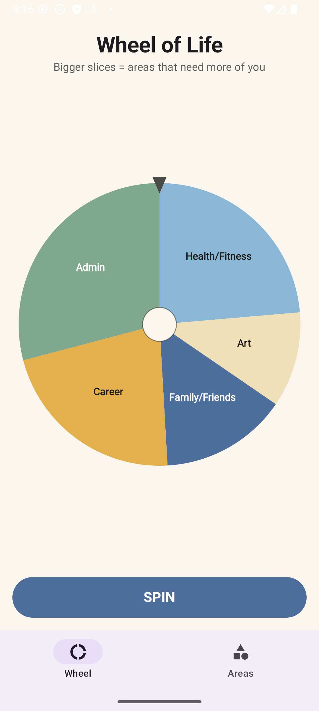
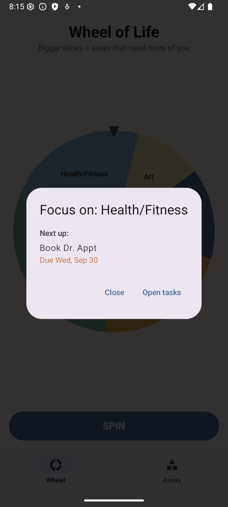
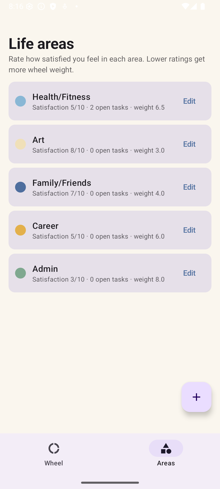
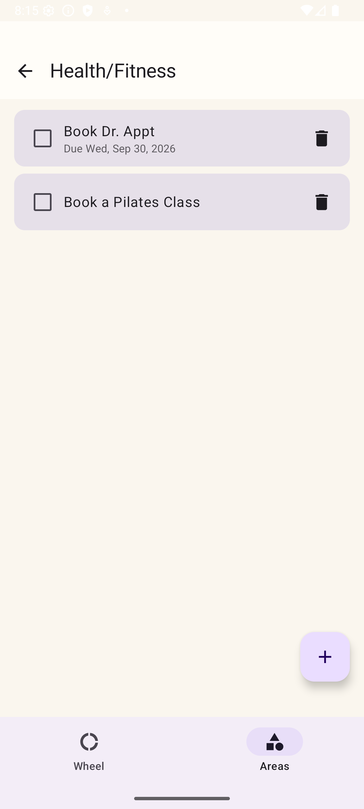

# Wheel of Life 🎡

A spin-the-wheel Android app for keeping your life in balance. Rate how satisfied you are in each area of your life, keep a task list per area, and when you can't decide what to tackle — spin. The wheel is weighted toward the areas you've been neglecting and the tasks with looming deadlines, and it rebalances itself as you get things done.

## What it does

- Add life areas, rate your satisfaction with each (1–10), and keep task lists with optional deadlines
- Spin the weighted wheel to pick what to work on next — neglected areas and urgent deadlines come up more often
- Slice sizes reveal your imbalance at a glance, and completing tasks shrinks a slice — the wheel rebalances as you make progress

## Screenshots

| Wheel | Spin result | Areas | Tasks |
|:---:|:---:|:---:|:---:|
|  |  |  |  |

## How the weighting works

Each area's spin weight is `(11 − effective satisfaction)`, plus an urgency boost for open tasks with deadlines (overdue +6, due ≤3 days +4, due ≤7 days +2, later +0.5). Completing tasks raises an area's effective satisfaction for up to 30 days (capped at +3), so tended areas shrink and neglected ones grow back.

The palette is muted but colorblind-safe (Okabe–Ito hue spacing) with staggered luminance so it also reads in grayscale, and every slice is text-labeled.

## Build

Kotlin · Jetpack Compose · Material 3 · Room. Min SDK 26.

```
./gradlew assembleDebug    # build
./gradlew installDebug     # install on a connected device
```

Or open the project in Android Studio and hit Run.
